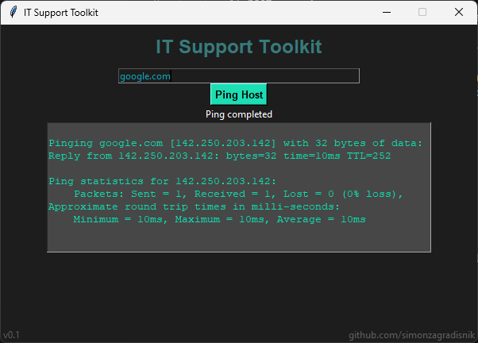

# IT Support Toolkit

A small Python desktop application I'm building while learning Python, Tkinter, and basic IT support concepts.

The goal of this project is to slowly build a simple toolkit for common IT support tasks while understanding the code behind each feature.

## Current Version

**v0.1**

The first version includes a basic GUI and host ping functionality.

## Features

- Simple desktop GUI built with Tkinter
- Enter a hostname or IP address
- Ping a host using the Windows `ping` command
- Display the ping output inside the application
- Basic validation for empty input

## Screenshot

## What I'm Practicing

This project is helping me practice:

- Tkinter GUI basics
- Functions
- `if` / `else`
- User input with `Entry`
- Updating GUI elements
- Using `subprocess` to run system commands
- Capturing command output
- Basic input validation
- IT support and troubleshooting concepts

## Planned Features

Some features I would like to add as I learn more:

- Better error handling
- DNS lookup
- HTTP status check
- Local IP information
- Better GUI layout and organization
- More IT support tools

## Learning Notes

I'm building this project step by step as I learn new Python and IT concepts.